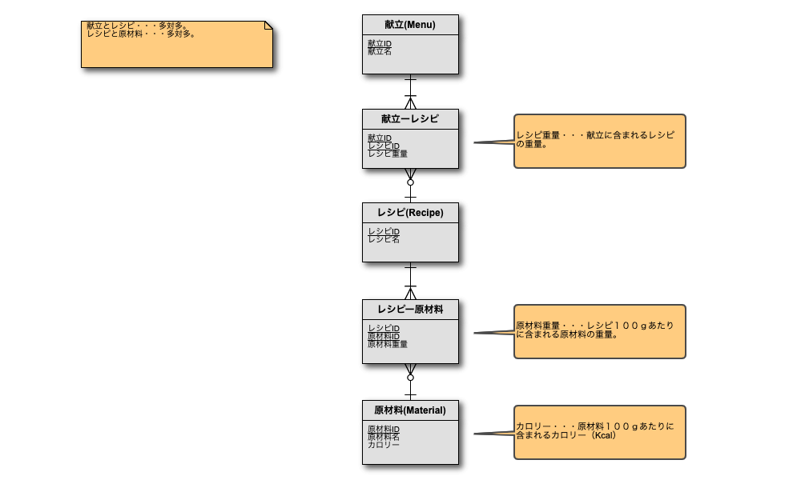

# ER図を元にして実際のテーブルを作成してみよ。

# 以下の献立をテーブルに上記で作成したテーブルに登録するSQLを作成せよ。また実際にSQLを実行してデータを登録せよ。

## 原材料

|ID|原材料名|カロリー|
|:-:|:-:|:-:|
|1|豚肉|100|
|2|鶏肉|200|
|3|牛肉|300|
|4|八方出汁|10|
|5|塩|5|
|6|胡椒|5|
|7|生姜|5|
|8|キャベツ|2|
|9|レタス|2|
|10|人参|4|
|11|水|0|
|12|白米|80|
|13|玄米|60|
|14|卵|150|

上記のカロリーは現実の原材料の値を反映したものではありません。

## レシピ

|ID|レシピ名|レシピ100gあたりの原材料|
|:-:|:-:|:-:|
|1|豚肉の生姜焼き|豚肉90g、生姜10g、塩3g|
|2|チキンソテー|鶏肉100g、八方出汁10g、塩4g|
|3|牛ハンバーグ|牛肉80、卵30g、塩5g|
|4|レタスサラダ|レタス100g|
|5|人参サラダ|キャベツ50g、人参50g|
|6|ご飯|白米50g、水50g|

空想のレシピですので原材料に意味はありません。また、水分が失われたりするため、原材料を全て足して100gになるとは限りません。

## メニュー

|ID|メニュー名|メニューを構成するレシピ|
|:-:|:-:|:-:|
|1|牛ハンバーグ弁当|牛ハンバーグ80g、ご飯50g、人参サラダ20g|
|2|チキン弁当|チキンソテー120g、ご飯50g、レタスサラダ20g|
|3|生姜焼き弁当|豚肉の生姜焼き100g、ご飯50g、人参サラダ30g|

# 上記で作成した各メニューのカロリーを算出するSQLを作成せよ。

# メニューの総平均カロリーを求めるSQLを作成せよ。

# 原材料として塩を含むメニューを抽出するSQLを作成せよ。

# カロリーが250Kcal以上のメニューを抽出するSQLを作成せよ。
